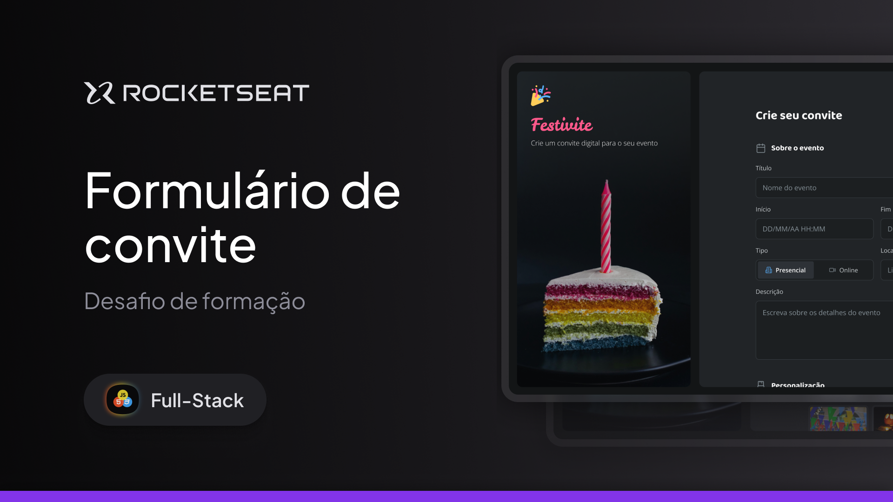
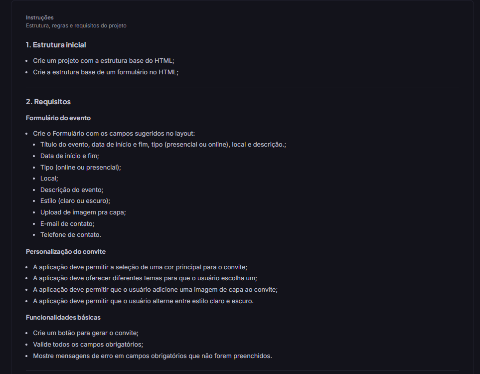

 
Desafio prático - Foi desenvolvido uma aplicação chamada Festivite, onde o usuário poderá criar convites digitais personalizados para diferentes tipos de eventos. O sistema deve permitir preencher informações como título, data, local e descrição, além de escolher cores, temas e imagens para o convite. Também será possível adicionar dados de contato e aceitar termos antes de gerar o convite final..

  <a href="#-tecnologias">Tecnologias</a>&nbsp;&nbsp;&nbsp;|&nbsp;&nbsp;&nbsp;
  <a href="#-requisitos">Requisitos</a>&nbsp;&nbsp;&nbsp;|&nbsp;&nbsp;&nbsp;
  <a href="#-checklist">Checklist do desenvolvimeto</a>

 

  

## Tecnologias

Esse projeto foi desenvolvido com as seguintes tecnologias:

- HTML
- CSS

## Requisitos

  

## Checklist do desenvolvimeto

  
</p